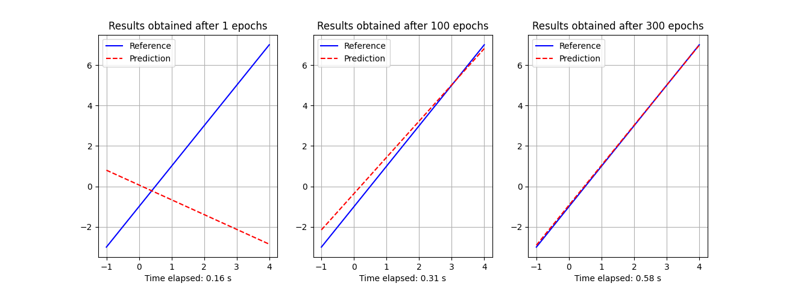

# Basic Tensorflow Examples

This project contains a few basic neural network examples inspired while I was following [Laurence Moroney](lmoroney)'s [Introduction to TensorFlow for Artificial Intelligence, Machine Learning, and Deep Learning](https://www.coursera.org/learn/introduction-tensorflow/home/info) course in Coursera.

In particular, the examples come from his lecture on "[the Hello World of neural networks](https://www.coursera.org/learn/introduction-tensorflow/lecture/kr51q/the-hello-world-of-neural-networks)" in which he shows probably the simplest example of an actual working neural network that performs a linear regression.

## Linear Regression Model

This example uses a neural network with only one neuron to perform a linear regression even using the same numbers as in Coursera's lecture.

```python
from hello_world.linear_regression_model import LinearRegressionModel

xs = [-1.0, 0.0, 1.0, 2.0, 3.0, 4.0]
ys = [-3.0, -1.0, 1.0, 3.0, 5.0, 7.0]

model = LinearRegressionModel(xs, ys)

ps = model.predict([10.0]) # 18.98 ~ 19.00
```

### Testing the linear model

The following code shows how we can plot the reference data against the data generated by our model so that we can see how good it fits.

```python
import numpy as np
from hello_world.linear_regression_model import LinearRegressionModel
from hello_world import plotter

xs = np.array([-1.0, 0.0, 1.0, 2.0, 3.0, 4.0], dtype=float)
ys = 2 * xs - 1

model = LinearRegressionModel(xs, ys)
ps = model.predict(xs)

plotter.plot(xs, ys, ps, "Results obtained after {} epochs".format(model.epochs))
```

As the image below shows, the results are insanely accurate but...

- what does it mean "500 epochs"?


#### How epochs affect the linear regression

The **LinearRegressionModel** class that we have been testing so far is set to use **500** epochs unless it's called to with a specific value. Let's now call it with different values and see how it affects the predictions.

```python
import numpy as np
from hello_world.linear_regression_model import LinearRegressionModel
from hello_world import plotter

def get_plot(epochs):
    xs = np.array([-1.0, 0.0, 1.0, 2.0, 3.0, 4.0], dtype=float)
    ys = 2 * xs - 1
    model = LinearRegressionModel(xs, ys, epochs=epochs)
    ps = model.predict(xs)
    title = "Results obtained after {} epochs".format(model.epochs)
    return {"xs": xs, "ys": ys, "ps": ps, "title": title}

plots = []

plots.append(get_plot(1))
plots.append(get_plot(100))
plots.append(get_plot(300))

plotter.multiplot(plots)
```

As the following stack of plots show, the more epochs, the more the predictions get closer to the reference.



#### How good is the model far from the reference points

```python
import numpy as np
from hello_world.linear_regression_model import LinearRegressionModel
from hello_world import plotter

x_refs = np.array([-1.0, 0.0, 1.0, 2.0, 3.0, 4.0], dtype=float)
y_refs = 2 * x_refs - 1

model = LinearRegressionModel(x_refs, y_refs)

xs = np.arange(-1000000000, 1000000000, 1000000, dtype=float)
ys = 2 * xs - 1
ps = model.predict(xs)

plotter.plot(xs, ys, ps, "Results obtained after {} epochs".format(model.epochs))
```


When you look at the following chart, pay attention to the **10e9** labels as they indicate that we are now asking the model to give us values that range from -1 to +1 (English) billions. That's not bad.

## Installation

This project was written with [Poetry](https://python-poetry.org). The following instructions should be sufficient for you to start using it.

```bash
git clone https://github.com/elcapo/hello_world.git
cd hello_world
poetry install
```

> Note that you'll need to install **git**, **python** and **poetry** to get this working.

## Usage

Once installed, use **Poetry**'s shell to interact with the package.

```bash
poetry shell
```

## Tests

To run the tests, use **PyTest** from your shell.

```bash
pytest -v
# or
poetry run pytest
```