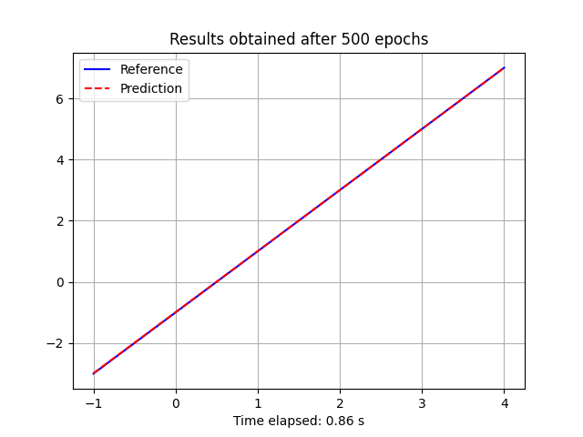

# Basic Tensorflow Examples

This project contains a few basic neural network examples inspired while I was following [Laurence Moroney](lmoroney)'s [Introduction to TensorFlow for Artificial Intelligence, Machine Learning, and Deep Learning](https://www.coursera.org/learn/introduction-tensorflow/home/info) course in Coursera.

In particular, the examples come from his lecture on "[the Hello World of neural networks](https://www.coursera.org/learn/introduction-tensorflow/lecture/kr51q/the-hello-world-of-neural-networks)" in which he shows probably the simplest example of an actual working neural network that performs a linear regression.

## Linear Regression

This example uses a neural network with only one neuron to perform a linear regression even using the same numbers as in Coursera's lecture.

```python
from hello_world.models import LinearRegressionModel

xs = [-1.0, 0.0, 1.0, 2.0, 3.0, 4.0]
ys = [-3.0, -1.0, 1.0, 3.0, 5.0, 7.0]

linear_regression = LinearRegressionModel(xs, ys)

ps = linear_regression.model.predict([10.0]) # 18.98 ~ 19.00
```

### Testing the linear model

The following code shows how we can plot the reference data against the data generated by our model so that we can see how good it fits.

```python
import time
import numpy as np
from hello_world.models import LinearRegressionModel
from hello_world import plotter

# Prepare the training data

xs = np.array([-1.0, 0.0, 1.0, 2.0, 3.0, 4.0], dtype=float)
ys = 2 * xs - 1

# Train our neural network

start = time.time()
linear_regression = LinearRegressionModel(xs, ys)
elapsed = time.time() - start

# Use the trained network to predict outputs

ps = linear_regression.model.predict(xs)

# Plot the results

title = "Results obtained after {} epochs".format(
    linear_regression.epochs)
x_label = "Time elapsed: {:.2f} s".format(elapsed)

figure = plotter.plot(xs, ys, ps, title, x_label)
figure.savefig("images/linear-regression-with-500-epochs.png")
```

As the image below shows, the results are insanely accurate but...

- what does it mean "500 epochs"?



#### How epochs affect the linear regression

The **LinearRegressionModel** class that we have been testing so far is set to use **500** epochs unless it's called to with a specific value. Let's now call it with different values and see how it affects the predictions.

```python
import time
import numpy as np
from hello_world.models import LinearRegressionModel
from hello_world import plotter

def get_plot(epochs):
    # Prepare the training data
    xs = np.array([-1.0, 0.0, 1.0, 2.0, 3.0, 4.0], dtype=float)
    ys = 2 * xs - 1
    # Train our neural network
    start = time.time()
    linear_regression = LinearRegressionModel(xs, ys, epochs=epochs)
    elapsed = time.time() - start
    # Use the trained network to predict outputs
    ps = linear_regression.model.predict(xs)
    # Prepare the plot
    title = "Results obtained after {} epochs".format(
        linear_regression.epochs)
    x_label = "Time elapsed: {:.2f} s".format(elapsed)
    return {"xs": xs, "ys": ys, "ps": ps, "title": title, "x_label": x_label, "y_label": None}

# Plot the results

plots = []

plots.append(get_plot(1))
plots.append(get_plot(100))
plots.append(get_plot(300))

figure = plotter.multiplot(plots)
figure.savefig("images/linear-regression-with-1-100-and-300-epochs.png")
```

As the following stack of plots show, the more epochs, the more the predictions get closer to the reference.


#### How good is the model far from the reference points

```python
import time
import numpy as np
from hello_world.models import LinearRegressionModel
from hello_world import plotter

# Prepare the training data

xs_train = np.array([-1.0, 0.0, 1.0, 2.0, 3.0, 4.0], dtype=float)
ys_train = 2 * xs_train - 1

# Train our neural network

start = time.time()
linear_regression = LinearRegressionModel(xs_train, ys_train)
elapsed = time.time() - start

# Use the trained network to predict outputs

xs = np.arange(-1000000000, 1000000000, 1000000, dtype=float)
ys = 2 * xs - 1
ps = linear_regression.model.predict(xs)

# Plot the results

title = "Results obtained after {} epochs".format(
    linear_regression.epochs)
x_label = "Time elapsed: {:.2f} s".format(elapsed)

figure = plotter.plot(xs, ys, ps, title, x_label)
figure.savefig("images/linear-regression-far-away-from-the-reference.png")
```

When you look at the following chart, pay attention to the **10e9** labels as they indicate that we are now asking the model to give us values that range from -1 to +1 (English) billions. That's not bad!


## Two Hidden Layers

### Approximating a quadratic function

As we may imagine, the linear regresion model won't help us learning non linear functions. This means that our neural network isn't yet able to learn a simple quadratic function like $x^2$.

In order to solve this, we have available a second model that also works with a single input and a single output, but contains two hidden intermediate layers.

As the code below shows, the number of units in each of the hidden layers can be set using the **hidden_units** argument.

```python
import time
import numpy as np
from hello_world.models import *
from hello_world import plotter

# Prepare the training data

xs = np.arange(-10, 10, dtype=float)
ys = xs**2

# Train our neural network

start = time.time()
hidden_layer = TwoHiddenLayerModel(xs, ys, epochs=3000, hidden_units=32)
elapsed = time.time() - start

# Use the trained network to predict outputs

ps = hidden_layer.model.predict(xs)

# Plot the results

title = "Model with {} units in a hidden layer after {} epochs".format(
    hidden_layer.hidden_units,
    hidden_layer.epochs)
x_label = "Time elapsed: {:.2f} s".format(elapsed)

figure = plotter.plot(xs, ys, ps, title, x_label)
figure.savefig("images/quadratic-approximation-using-two-hidden-layers.png")
```


### Approximating a sinusoidal function

Finally, let's test the two layers against a periodic function like $cos(x)$ and see what happens.

```python
import time
import numpy as np
from hello_world.models import *
from hello_world import plotter

# Prepare the training data

xs = np.arange(-10, 10, .1, dtype=float)
ys = np.cos(xs)

# Train our neural network

start = time.time()
hidden_layer = TwoHiddenLayerModel(xs, ys, epochs=3000, hidden_units=64)
elapsed = time.time() - start

# Use the trained network to predict outputs

ps = hidden_layer.model.predict(xs)

# Plot the results

title = "Model with {} units in a hidden layer after {} epochs".format(
    hidden_layer.hidden_units,
    hidden_layer.epochs)
x_label = "Time elapsed: {:.2f} s".format(elapsed)

figure = plotter.plot(xs, ys, ps, title, x_label)
figure.savefig("images/sinusoidal-approximation-using-two-hidden-layers.png")
```

As you can see, a pretty simple neural network can easily handle this. At least for ranges of points that are close to the points it was trained for.


### Forcing the machine

If you read all this, you probably want to see these algorithms limitations. Actually, if can easily change the previous code to make predict some points that are further than the points we included during the training.

```python
import time
import numpy as np
from hello_world.models import *
from hello_world import plotter

# Prepare the training data

xs_train = np.arange(-10, 10, .1, dtype=float)
ys_train = np.cos(xs_train)

# Train our neural network

start = time.time()
hidden_layer = TwoHiddenLayerModel(xs_train, ys_train, epochs=3000, hidden_units=64)
elapsed = time.time() - start

# Use the trained network to predict outputs

xs = np.arange(-20, 20, .1, dtype=float)
ys = np.cos(xs)
ps = hidden_layer.model.predict(xs)

# Plot the results

title = "Model with {} units in a hidden layer after {} epochs".format(
    hidden_layer.hidden_units,
    hidden_layer.epochs)
x_label = "Time elapsed: {:.2f} s".format(elapsed)

figure = plotter.plot(xs, ys, ps, title, x_label)
figure.savefig("images/sinusoidal-approximation-far-from-training-points.png")
```

As you can see, the network won't have a clue about what we are asking.


## Installation

This project was written with [Poetry](https://python-poetry.org). The following instructions should be sufficient for you to start using it.

```bash
git clone https://github.com/elcapo/hello_world.git
cd hello_world
poetry install
```

> Note that you'll need to install **git**, **python** and **poetry** to get this working.

## Usage

Once installed, use **Poetry**'s shell to interact with the package.

```bash
poetry shell
```

## Tests

To run the tests, use **PyTest** from your shell.

```bash
pytest -v
# or
poetry run pytest
```